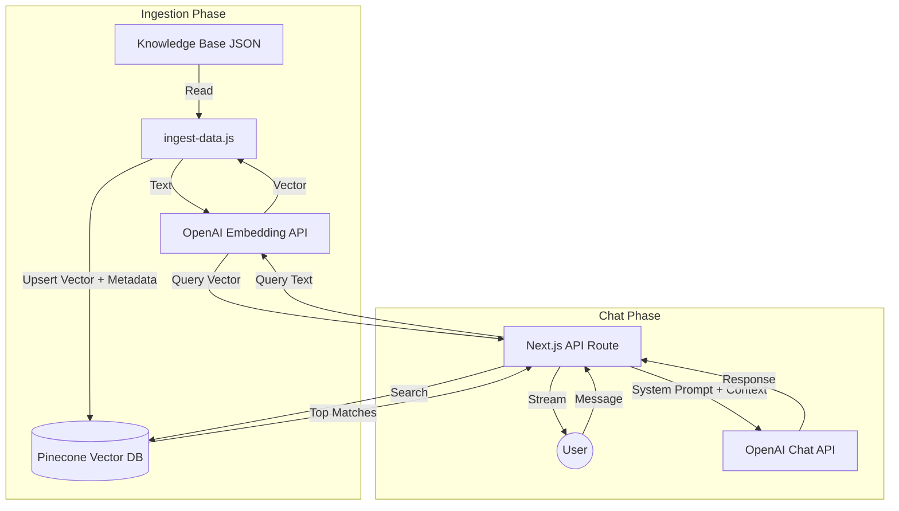

# RAG Implementation Flow

This document explains the Retrieval-Augmented Generation (RAG) architecture implemented in the HealthConnect chatbot.

## Overview

RAG combines the power of Large Language Models (LLMs) with a custom knowledge base. Instead of relying solely on the model's pre-trained data, we "retrieving" relevant information from our database and "augmenting" the prompt sent to the model.

## 1. Data Ingestion (Offline Process)

Before the chatbot can answer questions, we must populate the vector database with knowledge.

**File:** `scripts/ingest-data.js`
**Input:** `scripts/knowledge_base.json` (List of FAQ items)

1.  **Read Data**: The script reads the JSON file containing medical FAQs.
2.  **Generate Embeddings**: For each Q&A pair, it sends the text to OpenAI's `text-embedding-3-small` model.
    *   *Input*: "What are symptoms of a cold?"
    *   *Output*: `[0.123, -0.456, ...]` (A vector of numbers representing the meaning)
3.  **Store Vectors**: These vectors, along with the original text (metadata), are stored in the **Pinecone** vector database.

## 2. Chat Retrieval Flow (Runtime Process)

When a user sends a message to the chatbot:

**File:** `app/api/chat/route.js`

1.  **User Query**: The user types a question (e.g., "I have a headache and fever").
2.  **Generate Query Embedding**: The backend sends this question to OpenAI to convert it into a vector (same model as ingestion).
3.  **Vector Search (Retrieval)**:
    *   This query vector is sent to **Pinecone**.
    *   Pinecone searches for vectors that are mathematically "closest" (most similar) to the query vector.
    *   *Result*: It returns the top 3 most relevant FAQ items from our knowledge base.
4.  **Context Construction**:
    *   The backend extracts the text content from these matches.
    *   It creates a "System Prompt" that looks like:
        ```text
        You are a medical assistant. Use the following CONTEXT to answer the user:
        
        CONTEXT:
        - Question: What are cold symptoms? Answer: ...
        - Question: When to see a doctor? Answer: ...
        ```
5.  **LLM Generation**:
    *   This prompt, along with the user's message, is sent to OpenAI's `gpt-4o-mini`.
    *   The model uses the provided context to form an accurate, grounded answer.
6.  **Response**: The answer is streamed back to the frontend `ChatBot` component.

## Architecture Diagram


